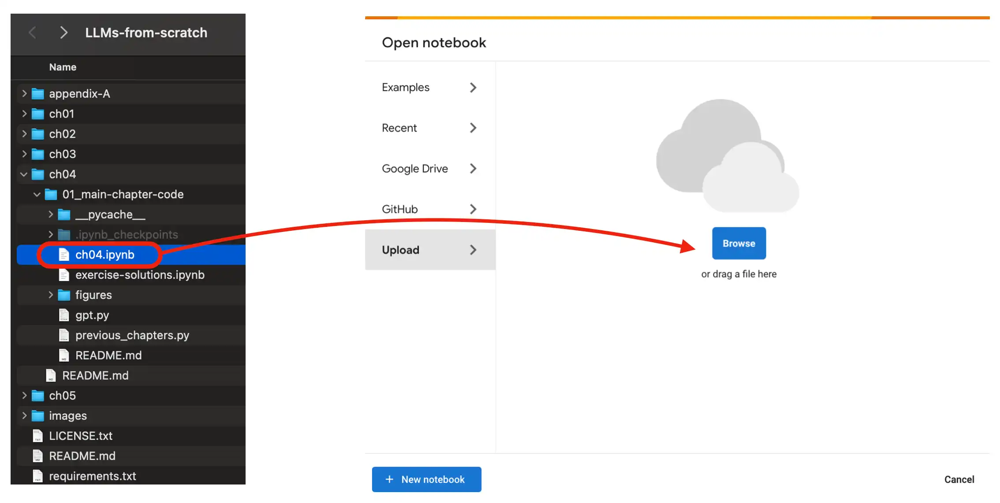
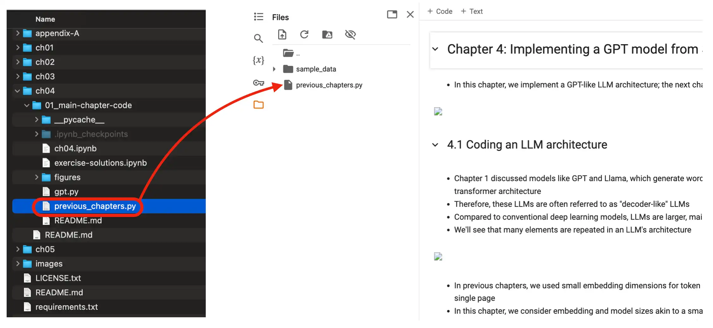
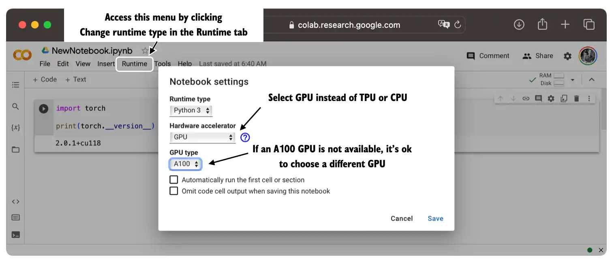

# Optional Setup Instructions


This document lists different approaches for setting up your machine and using the code in this repository. I recommend browsing through the different sections from top to bottom and then deciding which approach best suits your needs.

<br>

## Quickstart

If you already have a Python installation on your machine, the quickest way to get started is to install the package requirements from the [../requirements.txt](../requirements.txt) file by executing the following pip installation command from the root directory of this code repository:

```bash
pip install -r requirements.txt
```

<br>

## Setting up Python

If you don't have Python set up on your machine yet, I have written about my personal Python setup preferences in the following directories:

- [../appendix-A/01_optional-python-setup-preferences](../appendix-A/01_optional-python-setup-preferences)
- [../02_installing-python-libraries](../appendix-A/02_installing-python-libraries)


<br>

## Using Google Colab

To use a Google Colab environment in the cloud, head over to [https://colab.research.google.com/](https://colab.research.google.com/) and open the respective chapter notebook from the GitHub menu or by dragging the notebook into the *Upload* field as shown in the figure below.




Also make sure you upload the relevant files (dataset files and .py files the notebook is importing from) to the Colab environment as well, as shown below.




You can optionally run the code on a GPU by changing the *Runtime* as illustrated in the figure below.




<br>

## Using DevContainers

Alternatively, If you prefer a development setup that isolates a project's dependencies and configurations, using Docker is a highly effective solution. This approach eliminates the need to manually install software packages and libraries and ensures a consistent development environment. You can find more instructions for setting up Docker and using a DevContainer here in [../appendix-A/04_optional-docker-environment](../appendix-A/04_optional-docker-environment).

<br>

## Questions?

If you have any questions, please don't hesitate to reach out via the [Discussions](https://github.com/rasbt/LLMs-from-scratch/discussions) forum in this GitHub repository.