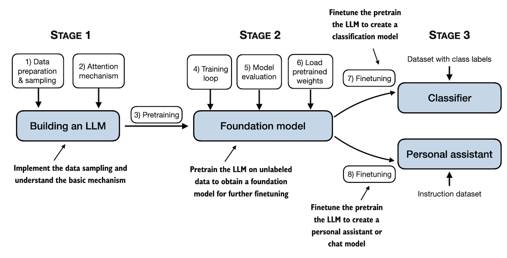

# Build a Large Language Model (From Scratch)

 
 

In [*Build a Large Language Model (from Scratch)*](http://mng.bz/orYv), you'll discover how LLMs work from the inside out. In this book, I'll guide you step by step through creating your own LLM, explaining each stage with clear text, diagrams, and examples. 

The method described in this book for training and developing your own small-but-functional model for educational purposes mirrors the approach used in creating large-scale foundational models such as those behind ChatGPT.

- Link to the official [source code repository](https://github.com/rasbt/LLMs-from-scratch)
- [Link to the early access version](http://mng.bz/orYv) at Manning
- ISBN 9781633437166
- Publication in Early 2025 (estimated)

 
 

## Table of Contents

| Chapter                                   | Main code                                                    | Code + supplementary         |
| ----------------------------------------- | ------------------------------------------------------------ | ---------------------------- |
| Ch 1: Understanding Large Language Models | No code                                                      | No code                      |
| Ch 2: Working with Text Data              | [ch02.ipynb](ch02/01_main-chapter-code/ch02.ipynb) [dataloader.ipynb](ch02/01_main-chapter-code/dataloader.ipynb) | [./ch02](./ch02)             |
| Ch 3: Understanding Attention Mechanisms  | [ch03.ipynb](ch03/01_main-chapter-code/ch03.ipynb) [multihead-attention.ipynb](ch03/01_main-chapter-code/multihead-attention.ipynb) | [./ch03](./ch03)             |
| ...                                       | ...                                                          | ...                          |
| Appendix A: Introduction to PyTorch       | [code-part1.ipynb](03_main-chapter-code/01_main-chapter-code/code-part1.ipynb) [code-part2.ipynb](03_main-chapter-code/01_main-chapter-code/code-part2.ipynb) [DDP-script.py](03_main-chapter-code/01_main-chapter-code/DDP-script.py) | [./appendix-A](./appendix-A) |

 
 

(A mental model summarizing the contents covered in this book.)
