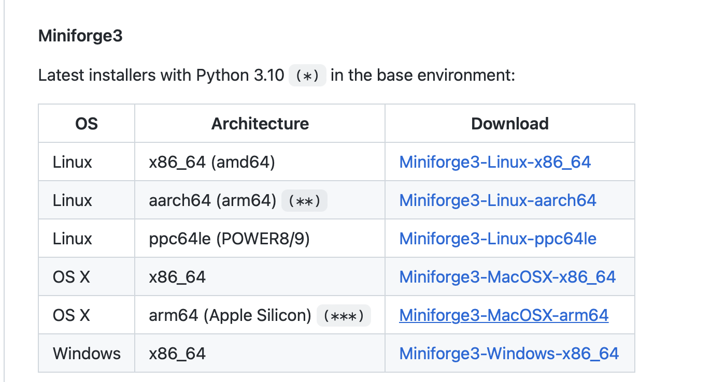
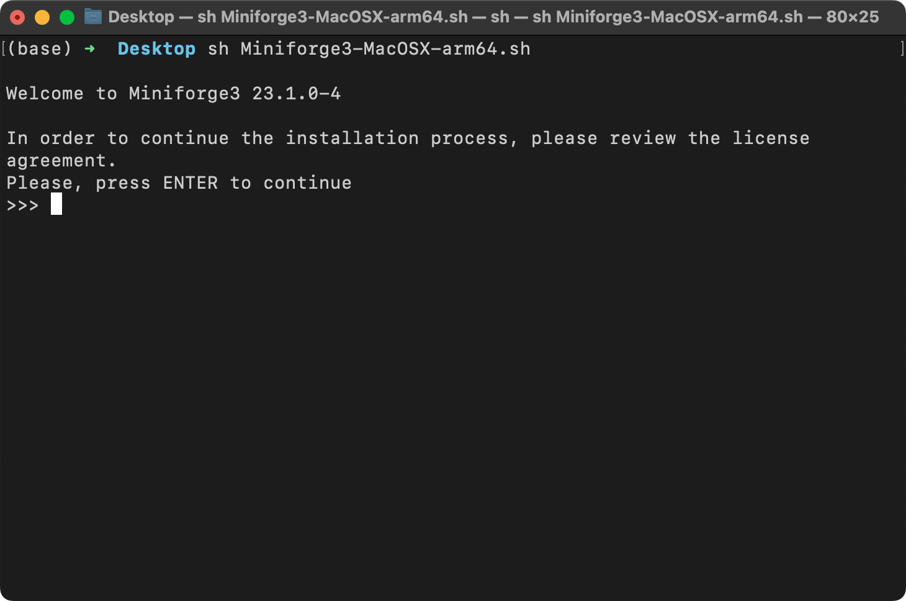

# Python Setup Tips


There are several different ways you can install Python and set up your computing environment. Here, I am illustrating my personal preference. 

(I am using computers running macOS, but this workflow is similar for Linux machines and may work for other operating systems as well.)


## 1. Download and install Miniforge

Download miniforge from the GitHub repository [here](https://github.com/conda-forge/miniforge).



Depending on your operating system, this should download either an `.sh` (macOS, Linux) or `.exe` file (Windows). 

For the `.sh` file, open your command line terminal and execute the following command

```bash
sh ~/Desktop/Miniforge3-MacOSX-arm64.sh
```

where `Desktop/` is the folder where the Miniforge installer was downloaded to. On your computer, you may have to replace it with `Downloads/`.



Next, step through the download instructions, confirming with "Enter".

## 2. Create a new virtual environment

After the installation was successfully completed, I recommend creating a new virtual environment called `dl-fundamentals`, which you can do by executing

```bash
conda create -n LLMs python=3.10
```


Next, activate your new virtual environment (you have to do it every time you open a new terminal window or tab):

```bash
conda activate dl-workshop
```


## Optional: styling your terminal

If you want to style your terminal similar to mine so that you can see which virtual environment is active,  check out the [Oh My Zsh](https://github.com/ohmyzsh/ohmyzsh) project.


# 3. Install new Python libraries


To install new Python libraries, you can now use the `conda` package installer. For example, you can install [JupyterLab](https://jupyter.org/install) and [watermark](https://github.com/rasbt/watermark) as follows:

```bash
conda install jupyterlab watermark
```


You can also still use `pip` to install libraries. By default, `pip` should be linked to your new `LLms` conda environment:


---


Any questions? Please feel free to reach out in the [Discussion Forum](https://github.com/rasbt/LLMs-from-scratch/discussions).