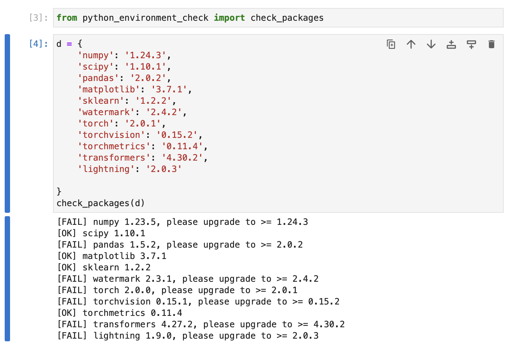

# Libraries Used In This Workshop

We will be using the following libraries in this workshop, and I highly recommend installing them before attending the event:

- numpy >= 1.24.3 (The fundamental package for scientific computing with Python)
- scipy >= 1.10.1 (Additional functions for NumPy)
- pandas >= 2.0.2 (A data frame library)
- matplotlib >= 3.7.1 (A plotting library)
- jupyterlab >= 4.0 (An application for running Jupyter notebooks)
- ipywidgets >= 8.0.6 (Fixes progress bar issues in Jupyter Lab)
- scikit-learn >= 1.2.2 (A general machine learning library)
- watermark >= 2.4.2 (An IPython/Jupyter extension for printing package information)
- torch >= 2.0.1 (The PyTorch deep learning library)
- torchvision >= 0.15.2 (PyTorch utilities for computer vision)
- torchmetrics >= 0.11.4 (Metrics for PyTorch)
- transformers >= 4.30.2 (Language transformers and LLMs for PyTorch)
- lightning >= 2.0.3 (A library for advanced PyTorch features: multi-GPU, mixed-precision etc.)

To install these requirements most conveniently, you can use the `requirements.txt` file:

```
pip install -r requirements.txt
```


Then, after completing the installation, please check if all the packages are installed and are up to date using

```
python_environment_check.py
```


It's also recommended to check the versions in JupyterLab by running the `jupyter_environment_check.ipynb` in this directory. Ideally, it should look like as follows:


If you see the following issues, it's likely that your JupyterLab instance is connected to wrong conda environment:




In this case, you may want to use `watermark` to check if you opened the JupyterLab instance in the right conda environment using the `--conda` flag:


