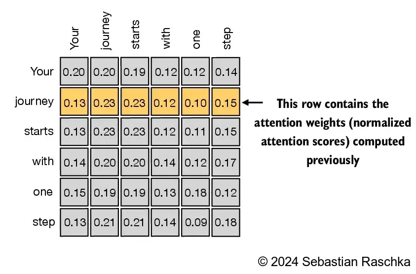
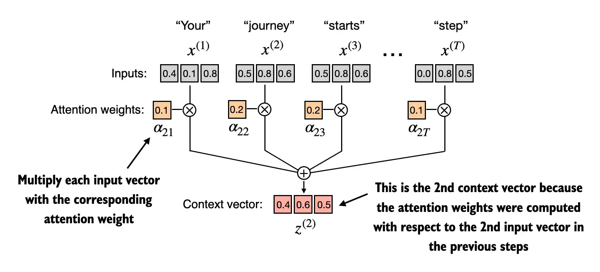

# 第三章 编码的注意力机制
## 3.1 注意力机制的基本概念
- 注意力机制是一种模仿人类注意力的机制
### 长序列建模中的问题
- RNN是在Transformer之前的主流模型
    - RNN是一种将前序步骤的输出作为输入的神经网络模型，文本是一种序列数据
    - 编码器逐次更新隐藏状态，并把最终的隐藏状态传递给解码器
    - 解码器逐次更新隐藏状态，并把最终的隐藏状态传递给输出层
    - RNN的每一步都依赖于前一步的输出
    - 编码器每一步都会更其隐藏状态，但这会导致每次试图在最后的隐藏层中捕获全部的含义，解码器也是类似，每一步更新，预测下一个词
- RNN在处理长序列时会遇到梯度消失和梯度爆炸的问题
    1. RNN在处理长序列时会遇到信息遗忘的问题
    2. 解码阶段，无法直接访问解码器中的早期状态
## 3.2 使用注意力机制捕捉数据依赖关系
### Bahdanan 注意力机制
- 解码器可以在每个解码步骤选择性访问输入序列中的不同部分
- 注意力机制是一种模仿人类注意力的机制,有点类似于人类在阅读时候的注意力可能除了当前聚焦的单词外，还会关注前面的词，抽出重点 (注：应该就是对于不同词的注意力权重不同)

## 3.3 通过自注意力机制关注输入的不同部分(以x^(2)为例，计算z^(2))
>自注意力机制中，‘自’指的是通过关联`单个`输入中的不同位置来计算注意力权重的能力
>而传统的注意力机制关注的是`不同`输入之间的关系

### 3.3.1 无可训练权重的简单自注意力机制
- 假设我们有输入词元x^(1), x^(2), ..., x^(6), dim=3
```python
import torch

inputs = torch.tensor(
  [[0.43, 0.15, 0.89], # Your     (x^1)
   [0.55, 0.87, 0.66], # journey  (x^2)
   [0.57, 0.85, 0.64], # starts   (x^3)
   [0.22, 0.58, 0.33], # with     (x^4)
   [0.77, 0.25, 0.10], # one      (x^5)
   [0.05, 0.80, 0.55]] # step     (x^6)
)
```
> ***本小节没有可训练权重，因此我们可以直接使用输入词元的嵌入向量来计算注意力权重***

- ***权重分数是两个向量相乘的结果，是一个`标量`，表示两个向量之间的相似度,下图中的每个元素都是通过两个向量相乘得到的(图中的值经过了softmax)***
- 通过计算输入序列中每个位置的加权平均值来捕捉输入序列中不同位置之间的关系
- 自注意力权重计算完后，是一个`n*n`的矩阵a，n是输入序列的长度，每一行代表一个词的注意力权重

- 序列中两两之间是通过嵌入向量的相乘得出(注：这里的嵌入向量是指每个词的向量表示,结果也没有被归一化)
- 通过`softmax`函数将注意力权重归一化为概率分布 (注：实际中会使用torch.softmax_naive来计算，确保每一行的和为1，即在所有维度的和为100%)
- 以上就是矩阵中的每个元素的计算方式，得到的是一个`n*n`的矩阵a，每个元素是他们之间的相似度，不过此时因为他们没有可训练的权重矩阵，每个相似度（权重）是固定的值


```python
## 计算x^(2)的注意力权重
query = inputs[1] # x^(2)
attention_scores = torch.empty(inputs.shape[0]) ## shape为[1,6]
for i in range(inputs.shape[0]):
    attention_scores[i] = torch.dot(query, inputs[i])
print(attention_weights)
# tensor([0.1552, 1.2275, 1.2174, 0.1033, 0.2006, 0.4960]) 可能大于一
## 计算softmax
attention_weights_2 = torch.softmax(attention_scores, dim=0)
# tensor([0.13, 0.23, 0.0.23, 0.0.12, 0.10, 0.0.15]) 和为1

```
#### 注意力权重计算完成，得到是与输入序列长度相同的向量，表示当前词与每个词的权重(词嵌入向量的相似度)


#### 上下文向量z，上文计算得到的是a^(i)

>定义是嵌入的输入词元x^(i)与他自己对应的注意力权重a^(i)的加权平均
```python
z^(i) = sum(a^(i,j) * x^(j)) for j in range(n)
 =>z^(i) = a^(i,1) * x^(1) + a^(i,2) * x^(2) + ... + a^(i,n) * x^(n)
 z^(2) = a^(2,1) * x^(1) + a^(2,2) * x^(2) + ... + a^(2,n) * x^(n)
 z^(2) = 0.13 * x^(1) + 0.23 * x^(2) + ... + 0.15 * x^(6)
```

每个词元的上下文向量z^(i)是一个加权平均值，包含了每个序列中词元的注意力权重，且还是一个向量(为什么是向量见下文)

其中 a^{(i,j)} 是标量,表示`权重`，x^{(j)} 是向量，表示每个`嵌入向量`。加权和的结果依然是一个与 x^{(j)} 维度相同的向量。


#### 为什么z还是一个向量
```text
z之所以还是一个向量，是因为它是对输入序列中每个词元的向量表示（如 x^(1), x^(2), ..., x^(n)）进行加权平均得到的。具体来说，每个输入词元本身就是一个高维向量（如3维、768维等），注意力权重只是标量，表示每个词元对当前上下文的贡献度。

数学表达式为：
```


#### 计算上下文矩阵
```python
z = attention_weights_2 @ inputs ##inputs是一个[6,3]的矩阵
print(z)
# tensor([0.43, 0.15, 0.89]
#         [0.55, 0.87, 0.66]
#         [0.57, 0.85, 0.64]
#         [0.22, 0.58, 0.33]
#         [0.77, 0.25, 0.10]
#         [0.05, 0.80, 0.55])
```

**通俗理解：**  
可以把每个词元的向量想象成“特征描述”，z 就是这些特征描述的加权平均，仍然是一个特征描述向量。
z 代表了在当前上下文下，所有输入词元的综合特征表达。
shape为[n, dim]，n是输入序列的长度，dim是嵌入向量的维度。
```

#### 来自于GPT的补充
``` text
z 计算完毕后，编码阶段通常还没有完全结束。z（上下文向量）只是自注意力机制输出的中间结果，代表每个输入词元在当前上下文下的综合表达。实际的编码阶段还包括以下几个常见步骤：

1. 残差连接与归一化（LayerNorm）
通常会将 z 与原始输入做残差连接，然后进行层归一化，以提升训练稳定性和表达能力。

2. 前馈神经网络（Feed Forward Network, FFN）
z 还会经过一个前馈全连接网络，进一步提升特征表达能力。

3. 多层堆叠
Transformer 编码器一般会堆叠多层自注意力+前馈网络结构，z 会作为下一层的输入，逐层提取更高层次的特征。

4. 最终输出
经过所有编码器层后，输出的 z 才作为编码阶段的最终结果，供解码器或下游任务使用。

- 以上来自于GPT的补充
```
##### 我的理解
> 最终的z是一个上下文向量矩阵，包含了每个词元的上下文信息，在dim级维度上，而RNN则只包含最终的隐藏状态，都是基于前面的输入计算得出，这样可以保持在一定input长度下，保留所有上下文信息
> RNN的计算是顺序的，而自注意力机制是并行的，计算效率更高,在编码阶段，是可以并行进行的


